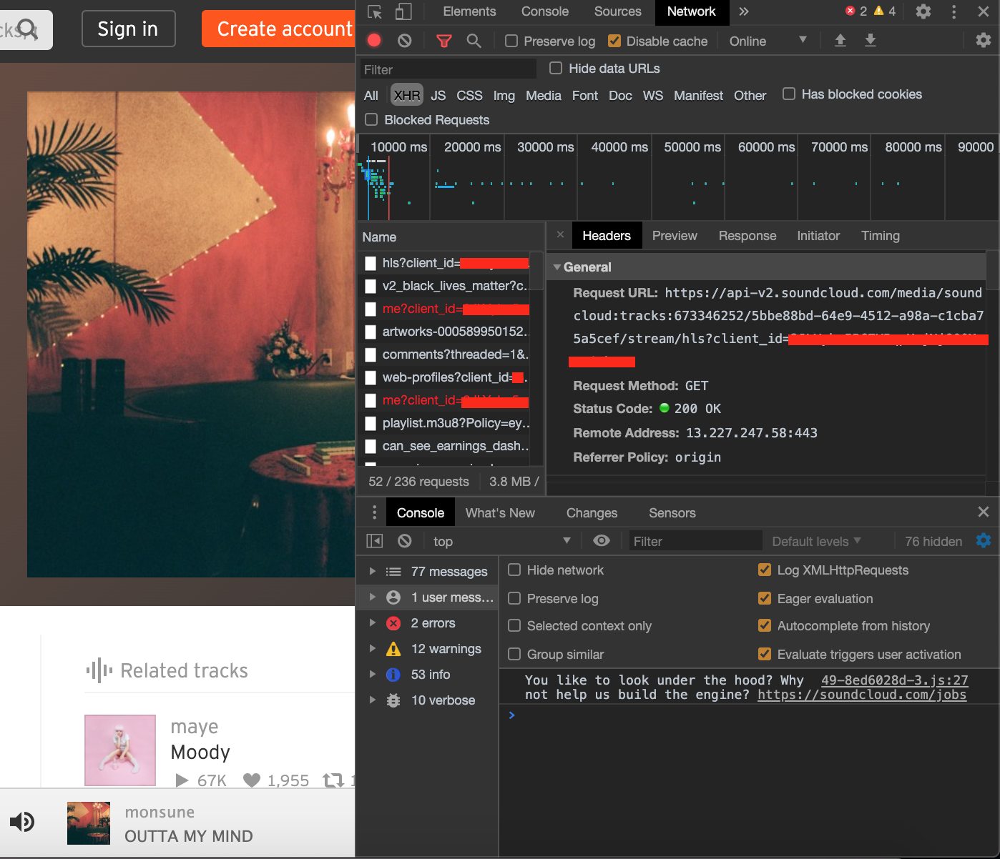

# node-soundcloud-downloader
Download Soundcloud tracks with Node.js
```
npm install soundcloud-downloader
```

I couldn't find any packages that worked with a Discord bot I was working on so I created my own. 

## API

### scdl.download(url, clientID)
- Gets the audio from the given URL, returns a [ReadableStream](https://nodejs.org/api/stream.html#stream_class_stream_readable).

### scdl.getInfo(url, clientID)
- Returns a JSON object containing the track's information, as well as media links.

### scdl.downloadMedia(media, clientID)
- `media` is one of the objects from the array `media.transcoding` in the JSON response of `scdl.getInfo(url, clientID)`
- Returns a ReadableStream like `scdl.download(url, clientID)`
- Use this if you want to download a specific audio format

### scdl.filterMedia(media, predicateObject)
- Filters through the track's media links returning the desired one
- `media` is one of the objects from the array `media.transcoding` in the JSON response of `scdl.getInfo(url, clientID)`
- `predicateObject` are the properties of the media you want to match

<details><summary>Example of media object (pass this in to `scdl.downloadMedia()` and `scdl.filterMedia`</summary>{
                "url": "https://api-v2.soundcloud.com/media/soundcloud:tracks:673346252/5bbe88bd-64e9-4512-a98a-c1cba75a5cef/stream/hls",
                "preset": "mp3_0_0",
                "duration": 226031,
                "snipped": false,
                "format": {
                    "protocol": "hls",
                    "mime_type": "audio/mpeg"
                },
                "quality": "sq"
            }</details>

## Examples
The easiest way to get Soundcloud audio is with the `scdl.download(url: string, clientID: string)` function, which returns a Promise containing a ReadableStream.
```javascript
const scdl = require('soundcloud-downloader')
const fs = require('fs')

const SOUNDCLOUD_URL = 'https://soundcloud.com/askdjfhaklshf'
const CLIENT_ID = 'asdhkalshdkhsf'

scdl.download(SOUNDCLOUD_URL, CLIENT_ID).then(stream => stream.pipe(fs.createWriteStream('audio.mp3')))
```

You can do anything you like with the stream that is returned, an example with [Discord.js](https://github.com/discordjs/discord.js/):
```javascript
const client = new Discord.Client()
const url = 'https://soundcloud.com/monsune_inc/outta-my-mind'
const clientID = 'asdlkajasd'
const channelID = '123456789'
client.on('ready', () => {
  const channel = client.channels.cache.get(channelID)
  channel.join().then(connection => {
    scdl.download(url, clientID).then(stream => {
      connection.play(stream)
    })
  })
})
```

You can view the code for these examples and find more in the [example](example) folder.


## Client ID
You can obtain a Client ID by visting the Soundcloud website and inspecting network traffic (perhaps with Chrome DevTools or some HTTP proxy software) and looking for any requests to the Soundcloud API. Ex:
```
https://api-v2.soundcloud.com/me/play-history/tracks?client_id={CLIENT ID IS HERE}&limit=25&offset=0&linked_partitioning=1&app_version=1590494738&app_locale=en
```

Here is a picture of where you should be able to find it:


## To-do
If I have the time and there is enough demand, I am interested in implementing the following functionalities:
- Audio format selection ✅
- Ability to use HTTP Live Streaming (HLS) ✅
- Some more integrations with Discord.js like selecting best format for voice channels

If you have any feature requests, suggestions or questions do not hesistate to post them in the issues section
